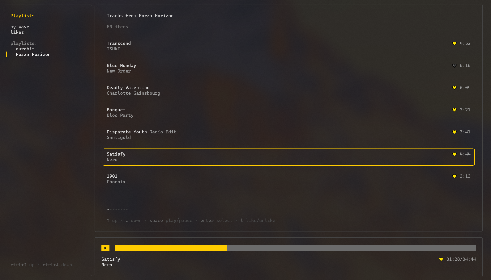

# yamusic-tui

[](https://github.com/DECE2183/yamusic-tui/blob/main/LICENSE)
[](https://goreportcard.com/report/github.com/dece2183/yamusic-tui)
[](https://github.com/dece2183/yamusic-tui/releases)

An unofficial Yandex Music terminal client.<br>
Based on [yandex-music-open-api](https://github.com/acherkashin/yandex-music-open-api).



### Requirements

To use this client, you should have a valid Yandex Music account and an access token.<br>
The easiest way to get a token is to use a browser extension ([Chrome](https://chrome.google.com/webstore/detail/yandex-music-token/lcbjeookjibfhjjopieifgjnhlegmkib), [Firefox](https://addons.mozilla.org/en-US/firefox/addon/yandex-music-token/)).

### Implemented features

 - [x] Player
    - [x] Play/pause
    - [x] Switch track
    - [x] Play progress
    - [x] Rewind
    - [x] Like/unlike
    - [x] Share
    - [x] Synced lyrics
 - [ ] Radio
    - [x] My wave
    - [ ] Radio configuration
 - [ ] Likes
    - [x] Liked tracks
    - [ ] Liked playlists
    - [ ] Liked artists
    - [ ] Liked albums
 - [x] Playlists
    - [x] Display user playlists
    - [x] Play from playlist
    - [x] Add/remove track to playlist
    - [x] Create/remove playlist
    - [x] Rename playlist
 - [x] Caching
 - [x] Search
 - [ ] Landing

## Installation

If you have Go installed on your PC:

```bash
go install github.com/dece2183/yamusic-tui@latest
```

Or just download the binary from the [releases](https://github.com/DECE2183/yamusic-tui/releases/latest) page.

Also available [Gentoo Linux ebuild](https://github.com/microcai/gentoo-zh/pull/7387/files).

## Configuration

The configuration file is located at `~/.config/yamusic-tui/config.yaml`.

This is the default configuration which is automatically created after the first login:

```yaml
token: <your yandex music token>
buffer-size-ms: 80
rewind-duration-s: 5
volume: 0.5
volume-step: 0.05
show-errors: false
show-lyrics: false
cache-tracks: likes # none/likes/all
cache-dir: ""
proxy: "" # proxy server URL; if not specified, uses the HTTP_PROXY and HTTPS_PROXY environment variables
search:
    artists: true
    albums: false
    playlists: false
controls:
   quit: ctrl+q,ctrl+c
   apply: enter
   cancel: esc
   cursor-up: up
   cursor-down: down
   show-all-keys: ?
   playlists-up: ctrl+up
   playlists-down: ctrl+down
   playlists-rename: ctrl+r
   playlists-hide: ctrl+b
   tracks-next-page: pgup
   tracks-previous-page: pgdown
   tracks-like: l
   tracks-add-to-playlist: a
   tracks-remove-from-playlist: ctrl+a
   tracks-share: ctrl+s
   tracks-shuffle: ctrl+x
   tracks-search: ctrl+f
   tracks-hide: ctrl+t
   player-pause: space
   player-next: right
   player-previous: left
   player-rewind-forward: ctrl+right
   player-rewind-backward: ctrl+left
   player-like: L
   player-cache: S
   player-vol-up: +,=
   player-vol-down: '-'
   player-toggle-lyrics: t
   player-hide: ctrl+p
style:
   volume-indicator-width: 16
   volume-indicator-autohide-at: 64
   side-panel-width: 32
   side-panel-autohide-at: 96
   search-modal-width: 56
   icons:
      play: ▶
      stop: ■
      liked: 💛
      not-liked: 🤍
      cached: 💿
      lyrics-dot: •
      volume-off: 🔇
      volume-low: 🔈
      volume-mid: 🔉
      volume-high: 🔊
   colors:
      accent: '#FC0'
      error: '#F33'
      border: '#444'
      background: '#6b6b6b'
      playlist-selection: '#4a3c00'
      active-text: '#EEE'
      normal-text: '#CCC'
      inactive-text: '#888'
      track-title-text: '#dcdcdc'
      track-version-text: '#999'
      track-artist-text: '#bbb'
      lyrics-previous: '#444'
      lyrics-current: '#EEE'
      lyrics-next: '#777'
```

By default, all cached tracks are stored in the system cache directory. `~/.cache/yamusic-tui` on Linux and `~/AppData/Local/yamusic-tui` on Windows.
You can change this behavior by specifying a preferred cache directory in the `cache-dir` field.

You can list multiple keys for the same control, separated by commas.

Increase the `buffer-size-ms` if you have glitches or stutters.

## System media controls


Yamusic-tui supports the system media control interfaces: `MPRIS` on Linux, `SMTC` on Windows, and `MPRemoteCommandCenter` on macOS.

This feature is enabled by default, however for compatibility reasons you can disable it by building the app with the `nomedia` tag or downloading a release with the `-nomedia` suffix.

```bash
go build -tags='nomedia'
```

### macOS

On macOS, media key support uses `MPRemoteCommandCenter` and `MPNowPlayingInfoCenter`, which display the current track in the system Now Playing widget and respond to media keys / Touch Bar controls.

Due to a Go linker limitation, the binary must be built with an external linker to include the required `LC_UUID` load command (enforced by dyld on macOS 15+):

```bash
go build -ldflags="-linkmode=external" -o yamusic-tui .
```
