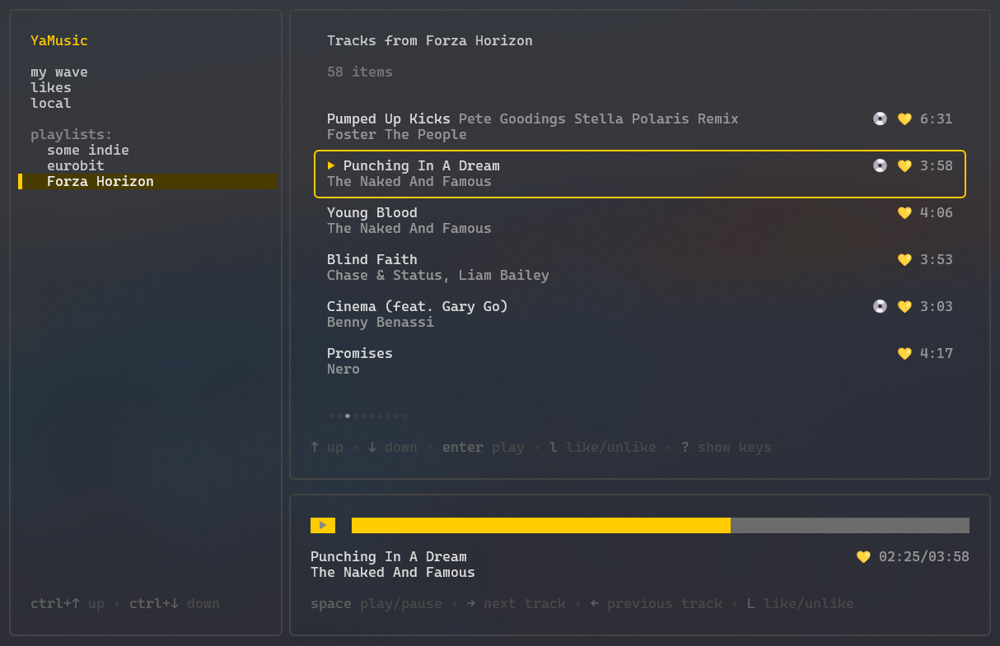

# yamusic-tui

An unofficial Yandex Music terminal client. 
Based on [yandex-music-open-api](https://github.com/acherkashin/yandex-music-open-api).

### Requirements

To use this client, you should have a valid Yandex Music account and an access token. 
The easiest way to get a token is to use this
[browser extension](https://github.com/MarshalX/yandex-music-token/tree/main/browser-extension).

### Implemented features

 - [x] Player control
    - [x] Play/pause
    - [x] Switch track
    - [x] Play progress
    - [x] Rewind
    - [x] Like/unlike
    - [x] Share
 - [ ] Radio
    - [x] My wave
    - [ ] Radio configuration
 - [ ] Likes
    - [x] Liked tracks
    - [ ] Liked playlists
    - [ ] Liked artists
    - [ ] Liked albums
 - [ ] Playlists
    - [x] Display user playlists
    - [x] Play from playlist
    - [ ] Add/remove track to playlist
    - [ ] Create/remove playlist
    - [ ] Rename playlist
 - [ ] Caching
 - [ ] Search
 - [ ] Landing